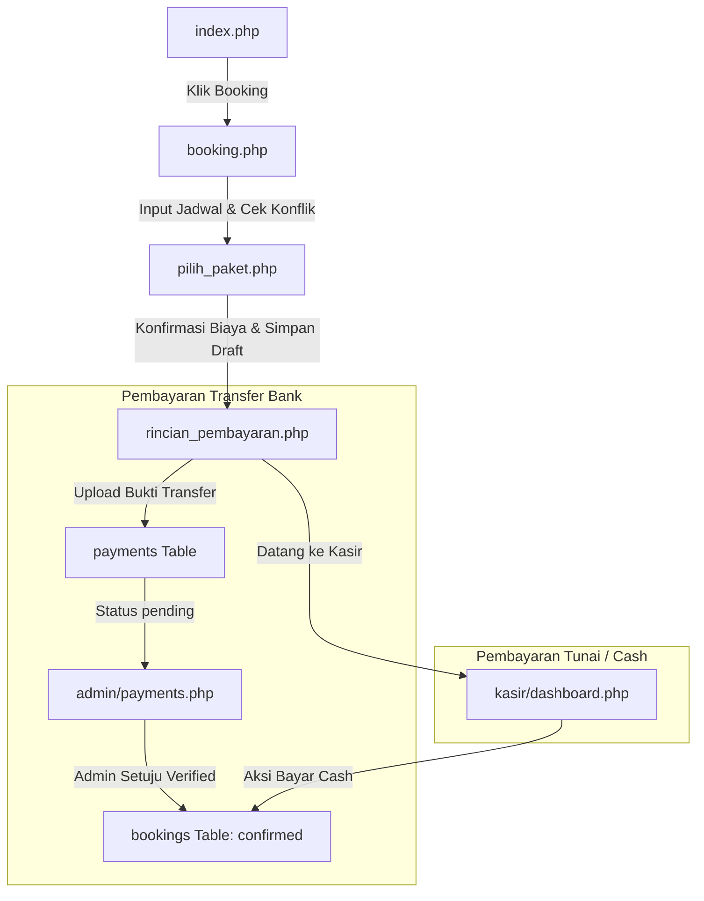
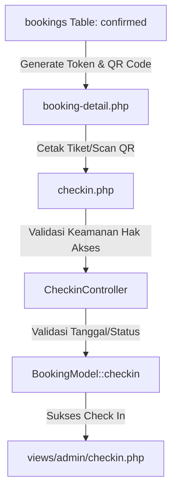

# Analisis Teknis & Arsitektur Project PadelClub

Dokumen ini merupakan hasil analisis menyeluruh terhadap source code project **PadelClub Management System** yang ditulis menggunakan PHP Native. Dokumen ini berfungsi sebagai *Knowledge Base* komprehensif bagi AI Agent maupun developer untuk memahami sistem secara utuh tanpa melakukan scanning ulang.

---

## 1. Struktur Folder

Berikut adalah visualisasi pohon struktur folder utama dalam project PadelClub:

```text
PadelClub/
│
├── admin/                     # Modul Dashboard & Kontrol Administrator
├── assets/                    # Aset Statis Frontend
│   ├── css/                   # Stylesheet Khusus (Tema)
│   ├── js/                    # Script Frontend (Tema & Interaksi)
│   └── style.css              # Custom CSS Utama Aplikasi
├── auth/                      # Integrasi Google OAuth Callback & Login
├── config/                    # File Konfigurasi Aplikasi & Koneksi Database
├── controllers/               # Logika Pengendali Bisnis (Controllers)
├── docs/                      # Dokumentasi Teknis & PRD
├── helpers/                   # Kumpulan Helper System (QR & Backup)
├── includes/                  # Komponen UI Template (Header & Footer)
├── kasir/                     # Modul POS (Point of Sale) & Struk Kasir
├── models/                    # Logika Akses Data & Query (Models)
├── storage/                   # Penyimpanan Log & File ZIP Backup Database
│   ├── backups/               # Tempat Penyimpanan Hasil Backup Database
│   └── logs/                  # Penyimpanan File Log Operasional
├── uploads/                   # Penyimpanan File Unggahan Pengguna
│   └── bukti_transfer/        # Bukti Transfer Pembayaran Lapangan Customer
├── vendor/                    # Dependensi Library Composer (Autoload)
└── views/                     # Komponen Tampilan Khusus Modul
    └── admin/                 # Halaman Render Dashboard Khusus Admin
```

### Penjelasan Fungsi Folder

1. **`admin/`**: Menyimpan seluruh berkas PHP halaman antarmuka administrator. Menangani manajemen booking, manajemen lapangan (courts), statistik pengguna (customers), pelaporan keuangan, log cadangan, pemulihan database (restore), serta manajemen staff.
2. **`assets/`**: Menyimpan berkas tampilan web, termasuk `style.css` (desain layout, warna, tombol) dan file pendukung `theme.css`/`theme.js` untuk mengontrol pergantian mode gelap (dark mode) secara dinamis menggunakan *Local Storage*.
3. **`auth/`**: Mengelola proses login menggunakan Google OAuth 2.0 API, menangani login callback dan pembuatan akun otomatis bagi user baru yang mendaftar via Google.
4. **`config/`**: Folder pusat konfigurasi. Berisi `koneksi.php` (inisialisasi mysqli & PDO serta migrasi otomatis), `oauth.php` (pengaturan client Google API), dan file penyimpanan status JSON seperti `settings.json` dan `backup_settings.json`.
5. **`controllers/`**: Menyimpan logika bisnis berorientasi objek. `BackupController.php` mengelola pembuatan/pemulihan database serta ekspor data, sedangkan `CheckinController.php` memvalidasi kelayakan tiket QR digital customer saat bermain.
6. **`docs/`**: Folder khusus dokumentasi. Berisi `prd.md` (Product Requirement Document) dan berkas `analisa.md` ini.
7. **`helpers/`**: Berisi class helper utilitas. `BackupHelper.php` membantu kompresi ZIP dan audit IP/Browser, sementara `QRHelper.php` membungkus integrasi library Endroid QR Code untuk menghasilkan kode QR URL check-in.
8. **`includes/`**: Menyimpan kerangka template antarmuka global (`header.php` dan `footer.php`). Memuat navigasi menu sidebar dinamis sesuai level akses pengguna (`admin`, `kasir`, atau `customer`).
9. **`kasir/`**: Berisi sistem Point of Sale (POS) bagi petugas kasir di lapangan untuk mengonfirmasi pemesanan masuk secara *real-time*, memproses pembayaran tunai (cash) di tempat, dan mengunduh cetak struk pembayaran berformat PDF (A5).
10. **`models/`**: Representasi akses database berorientasi objek. `BookingModel.php` menangani manipulasi records reservasi & check-in, dan `BackupModel.php` menangani dump query tabel SQL & log cadangan.
11. **`storage/`**: Folder penyimpanan internal server untuk menampung file ZIP hasil backup dan rekaman audit log.
12. **`uploads/bukti_transfer/`**: Folder tempat menyimpan file bukti transfer bank (.jpg, .png, .pdf) yang diunggah customer ketika melakukan konfirmasi pembayaran.
13. **`vendor/`**: Folder auto-generated dari Composer yang memuat library pihak ketiga seperti Dompdf, PhpSpreadsheet, PhpDotenv, Google API Client, dan Endroid QR Code.
14. **`views/`**: Folder penampung berkas layout render PHP untuk menyederhanakan kode controller, contohnya `views/admin/checkin.php` untuk menampilkan status pemindaian tiket.

---

## 2. Analisa Semua File

Berikut adalah analisis mendalam dari **setiap berkas** yang terdapat dalam project PadelClub:

### Berkas Konfigurasi & Inisialisasi

#### 1. `koneksi.php`
- **Lokasi**: `/config/koneksi.php`
- **Fungsi**: File inti koneksi database dan sinkronisasi otomatis skema tabel (Auto Migration).
- **Tanggung Jawab**:
  - Membaca variabel `.env` menggunakan library `vlucas/phpdotenv`.
  - Melakukan inisiasi koneksi MySQLi (`$conn`) dan PDO (`$pdo`) secara global.
  - Melakukan sinkronisasi otomatis kolom tabel (menambahkan `role='kasir'`, kolom oauth Google, check-in, dan token booking).
  - Menyediakan helper global `updateBookingVerification()` untuk menyinkronkan status pembayaran dengan status booking.
  - Memastikan user pengujian (`admin@MyPadel.com` dan `kasir@MyPadel.com`) selalu terdaftar dengan password default (`password`) di database.
- **Digunakan Oleh**: Hampir seluruh berkas PHP dalam sistem (melalui `require_once`).
- **Bergantung Pada**: `/vendor/autoload.php`, `/.env`.
- **Database**: Tabel `users`, `bookings`, `payments`, dan `backup_logs`.
- **Request**: SESSION (untuk melacak operator verifikasi).
- **Output**: Objek koneksi `$conn` (MySQLi) dan `$pdo` (PDO), serta fungsi utilitas database.

#### 2. `oauth.php`
- **Lokasi**: `/config/oauth.php`
- **Fungsi**: Konfigurasi Google Client Service untuk Google OAuth.
- **Tanggung Jawab**: Inisialisasi objek `Google\Client` dengan mengambil ID Client, Secret, dan Redirect URI dari `.env`, serta mendaftarkan cakupan data (scopes) `email` dan `profile`.
- **Digunakan Oleh**: `/auth/google-login.php`, `/auth/google-callback.php`.
- **Bergantung Pada**: `/config/koneksi.php`, `/vendor/autoload.php`.
- **Database**: -
- **Request**: -
- **Output**: Objek `Google\Client` yang sudah terkonfigurasi.

#### 3. `settings.json`
- **Lokasi**: `/config/settings.json`
- **Fungsi**: File penyimpanan konfigurasi statis profil PadelClub.
- **Tanggung Jawab**: Menyimpan nama klub, nomor telepon, alamat fisik, jam operasional buka/tutup, dan multiplier pengali harga lapangan.
- **Digunakan Oleh**: `/admin/settings.php` (Read & Write).
- **Bergantung Pada**: -
- **Database**: -
- **Request**: -
- **Output**: JSON data string.

#### 4. `backup_settings.json`
- **Lokasi**: `/config/backup_settings.json`
- **Fungsi**: File penyimpanan konfigurasi status pencadangan berkala.
- **Tanggung Jawab**: Menyimpan frekuensi backup otomatis (`off`, `daily`, `weekly`, `monthly`) dan waktu terakhir eksekusi dijalankan.
- **Digunakan Oleh**: `/admin/backup_settings.php`, `/cron_backup.php`.
- **Bergantung Pada**: -
- **Database**: -
- **Request**: -
- **Output**: JSON data string.

#### 5. `.env`
- **Lokasi**: `/.env`
- **Fungsi**: Konfigurasi environment level aplikasi.
- **Tanggung Jawab**: Menyimpan data sensitif seperti detail koneksi database, URL dasar aplikasi, nama session, umur session, serta kredensial Google OAuth API.
- **Digunakan Oleh**: `/config/koneksi.php`.
- **Bergantung Pada**: -
- **Database**: -
- **Request**: -
- **Output**: Kunci konfigurasi sistem.

---

### Berkas Autentikasi

#### 6. `google-login.php`
- **Lokasi**: `/auth/google-login.php`
- **Fungsi**: Menangani inisiasi login Google OAuth.
- **Tanggung Jawab**: Membuat state token CSRF unik, menyimpannya di session, dan mengalihkan customer ke URL persetujuan akun Google.
- **Digunakan Oleh**: `/login.php`, `/register.php` (Tombol "Masuk/Daftar dengan Google").
- **Bergantung Pada**: `/config/oauth.php`.
- **Database**: -
- **Request**: SESSION.
- **Output**: Redirect URL ke halaman Google Consent.

#### 7. `google-callback.php`
- **Lokasi**: `/auth/google-callback.php`
- **Fungsi**: Endpoint penerima data dari server otorisasi Google.
- **Tanggung Jawab**:
  - Memvalidasi state CSRF untuk keamanan token.
  - Menukarkan auth code menjadi akses token.
  - Mengambil data profil Google (ID, Nama, Email, Avatar).
  - Melakukan pencarian email di database: jika email terdaftar maka otomatis terhubung; jika belum terdaftar maka membuat akun customer baru dengan password acak.
  - Mendaftarkan session login (`user_id`, `nama`, `role`) dan mengalihkan pengguna sesuai role.
- **Digunakan Oleh**: Google OAuth Redirect Service.
- **Bergantung Pada**: `/config/oauth.php`.
- **Database**: Tabel `users` (Select, Update, atau Insert).
- **Request**: GET (membaca `state` dan `code`), SESSION.
- **Output**: Redirect ke Dashboard masing-masing.

#### 8. `login.php`
- **Lokasi**: `/login.php`
- **Fungsi**: Halaman login manual lokal.
- **Tanggung Jawab**:
  - Menyajikan form input email dan password.
  - Memvalidasi data input pengguna (di mode development, verifikasi menggunakan perbandingan string langsung, bukan `password_verify`).
  - Menyimpan data user login ke session.
  - Mengarahkan kembali ke halaman target asal (jika ada parameter redirect).
- **Digunakan Oleh**: Akses manual pengunjung umum atau pemindaian tiket QR sebelum petugas masuk sistem.
- **Bergantung Pada**: `/config/koneksi.php`, `/includes/header.php`, `/includes/footer.php`.
- **Database**: Tabel `users`.
- **Request**: POST (input login), GET (param `redirect` & error), SESSION.
- **Output**: HTML, Redirect.

#### 9. `register.php`
- **Lokasi**: `/register.php`
- **Fungsi**: Form registrasi customer lokal baru.
- **Tanggung Jawab**: Memeriksa kelayakan data input customer baru, memvalidasi email unik, menyimpan password dalam bentuk plain text (development mode), dan memasukkan data customer ke tabel users.
- **Digunakan Oleh**: Pengunjung umum.
- **Bergantung Pada**: `/config/koneksi.php`, `/includes/header.php`, `/includes/footer.php`.
- **Database**: Tabel `users` (Insert).
- **Request**: POST (input data diri), SESSION.
- **Output**: HTML, Redirect ke `login.php?msg=registered` saat sukses.

#### 10. `logout.php`
- **Lokasi**: `/logout.php`
- **Fungsi**: Mengakhiri session login pengguna.
- **Tanggung Jawab**: Menghapus seluruh array `$_SESSION` dan menghancurkan session yang aktif di server.
- **Digunakan Oleh**: Tombol navigasi keluar pada layout header.
- **Bergantung Pada**: SESSION.
- **Request**: GET, SESSION.
- **Output**: Redirect ke `index.php?msg=logout`.

---

### Halaman Utama & Reservasi (Customer-Facing)

#### 11. `index.php`
- **Lokasi**: `/index.php`
- **Fungsi**: Halaman beranda utama platform.
- **Tanggung Jawab**:
  - Menyediakan filter pencarian tipe lapangan, tanggal, dan jam bermain.
  - Menampilkan daftar lapangan aktif beserta harganya.
  - Menampilkan ringkasan statistik (jumlah member, lapangan, dan booking sukses).
  - Menyediakan tombol CTA (Call to Action) cepat untuk memesan lapangan.
- **Digunakan Oleh**: Akses dasar pengunjung umum.
- **Bergantung Pada**: `/config/koneksi.php`, `/includes/header.php`, `/includes/footer.php`.
- **Database**: Tabel `courts`, `users`, `bookings`.
- **Request**: GET (filter parameter), SESSION.
- **Output**: HTML.

#### 12. `about.php`
- **Lokasi**: `/about.php`
- **Fungsi**: Halaman statis informasi profil PadelClub.
- **Tanggung Jawab**: Memberikan detail informasi mengenai visi, misi, fasilitas lapangan, dan keunggulan PadelClub Premium.
- **Digunakan Oleh**: Navigasi footer/header.
- **Bergantung Pada**: `/includes/header.php`, `/includes/footer.php`.
- **Database**: -
- **Request**: GET, SESSION.
- **Output**: HTML.

#### 13. `contact.php`
- **Lokasi**: `/contact.php`
- **Fungsi**: Halaman informasi kontak bantuan.
- **Tanggung Jawab**: Menampilkan alamat lengkap klub, nomor telepon layanan, email resmi, jam operasional, dan peta lokasi interaktif.
- **Digunakan Oleh**: Navigasi footer/header.
- **Bergantung Pada**: `/includes/header.php`, `/includes/footer.php`.
- **Database**: -
- **Request**: GET, SESSION.
- **Output**: HTML.

#### 14. `booking.php`
- **Lokasi**: `/booking.php`
- **Fungsi**: Form langkah pertama pemesanan lapangan.
- **Tanggung Jawab**:
  - Customer memilih lapangan, menentukan tanggal, jam mulai, dan jam selesai.
  - Memvalidasi agar tanggal booking tidak di masa lalu.
  - Menolak booking jika bertabrakan dengan jadwal confirmed/pending lainnya di database.
  - Menyimpan data reservasi sementara ke `$_SESSION['booking_draft']`.
- **Digunakan Oleh**: Customer yang ingin bertransaksi.
- **Bergantung Pada**: `/config/koneksi.php`, `/includes/header.php`, `/includes/footer.php`.
- **Database**: Tabel `courts`, `bookings` (cek ketersediaan).
- **Request**: GET (param `court_id`), POST (submit input jadwal), SESSION (wajib login).
- **Output**: HTML, Redirect ke `pilih_paket.php`.

#### 15. `pilih_paket.php`
- **Lokasi**: `/pilih_paket.php`
- **Fungsi**: Form langkah kedua pemilihan paket & opsi tambahan.
- **Tanggung Jawab**:
  - Menghitung durasi jam sewa secara otomatis.
  - Customer memilih paket: `per_jam` (durasi x tarif lapangan) atau `per_match` (tarif flat Rp 250.000).
  - Menyediakan opsional sewa raket (tambahan Rp 50.000).
  - Menampilkan konfirmasi ringkasan biaya sewa melalui modal pop-up interaktif.
  - Menyimpan booking berstatus `pending` ke database.
- **Digunakan Oleh**: Alur pemesanan lapangan setelah `booking.php`.
- **Bergantung Pada**: `/config/koneksi.php`, `/includes/header.php`, `/includes/footer.php`.
- **Database**: Tabel `courts`, `bookings` (Insert).
- **Request**: POST (mengonfirmasi sewa), AJAX (submit fetch data), SESSION.
- **Output**: HTML, JSON (jika AJAX), Redirect ke `rincian_pembayaran.php`.

#### 16. `rincian_pembayaran.php`
- **Lokasi**: `/rincian_pembayaran.php`
- **Fungsi**: Halaman konfirmasi metode bayar dan upload berkas pembayaran.
- **Tanggung Jawab**:
  - Menyajikan form upload bukti transfer (hanya format JPG/PNG/PDF, maksimal ukuran 2MB).
  - Menyimpan file bukti transfer ke folder `/uploads/bukti_transfer/` dengan penamaan terstruktur.
  - Mencatat data pembayaran baru di tabel `payments`.
  - Jika memilih pembayaran `Cash` (Tunai), status booking otomatis berubah menjadi confirmed.
  - Menyediakan tombol pembatalan booking (soft cancel) yang mengubah status menjadi `cancelled`.
- **Digunakan Oleh**: Customer setelah membuat booking atau memantau status bayar di riwayat.
- **Bergantung Pada**: `/config/koneksi.php`, `/includes/header.php`, `/includes/footer.php`.
- **Database**: Tabel `bookings`, `courts`, `users`, `payments`.
- **Request**: POST (upload berkas & batal sewa), UPLOAD (berkas bukti), AJAX (fetch submit), SESSION.
- **Output**: HTML, JSON, Redirect.

#### 17. `booking-detail.php`
- **Lokasi**: `/booking-detail.php`
- **Fungsi**: Tiket digital / Halaman informasi detail sewa lapangan.
- **Tanggung Jawab**:
  - Menampilkan ringkasan data sewa lapangan yang dibeli.
  - Memanggil `QRHelper` untuk merender QR Code check-in (wajib berstatus `Verified`).
  - Menyediakan tautan cepat untuk download QR Code PNG atau cetak invoice PDF.
- **Digunakan Oleh**: Customer lewat riwayat dashboard atau Admin lewat daftar booking.
- **Bergantung Pada**: `/config/koneksi.php`, `/models/BookingModel.php`, `/helpers/QRHelper.php`, `/includes/header.php`, `/includes/footer.php`.
- **Database**: Tabel `bookings`, `courts`, `users`.
- **Request**: GET (param `code`), SESSION (validasi hak akses kepemilikan).
- **Output**: HTML.

#### 18. `dashboarduser.php`
- **Lokasi**: `/dashboarduser.php`
- **Fungsi**: Dashboard internal customer.
- **Tanggung Jawab**:
  - Menampilkan profil ringkas customer dan total belanja/reservasi.
  - Menyajikan tabel riwayat reservasi lengkap dengan status booking, pembayaran, visualisasi QR Code, dan tombol aksi.
  - Memproses request pembatalan booking berstatus pending.
- **Digunakan Oleh**: Customer terautentikasi.
- **Bergantung Pada**: `/config/koneksi.php`, `/helpers/QRHelper.php`, `/includes/header.php`, `/includes/footer.php`.
- **Database**: Tabel `users`, `bookings`, `courts`, `payments`.
- **Request**: GET (param `cancel_id` pembatalan cepat), SESSION.
- **Output**: HTML, Redirect.

#### 19. `download_qr.php`
- **Lokasi**: `/download_qr.php`
- **Fungsi**: Aksi unduhan QR Code PNG.
- **Tanggung Jawab**: Mengubah token check-in menjadi raw bytes gambar PNG menggunakan `QRHelper` dan mengirimkannya ke browser dengan header download attachment.
- **Digunakan Oleh**: Customer via halaman tiket digital `booking-detail.php`.
- **Bergantung Pada**: `/config/koneksi.php`, `/models/BookingModel.php`, `/helpers/QRHelper.php`.
- **Database**: Tabel `bookings`.
- **Request**: GET (param `code`), SESSION.
- **Output**: Download File PNG.

#### 20. `invoice.php`
- **Lokasi**: `/invoice.php`
- **Fungsi**: Cetak dokumen invoice resmi.
- **Tanggung Jawab**: Membaca data booking terverifikasi, menyusun layout dokumen, menyisipkan QR Code berformat Base64, dan memproses render PDF menggunakan library Dompdf.
- **Digunakan Oleh**: Customer via link tiket digital.
- **Bergantung Pada**: `/config/koneksi.php`, `/models/BookingModel.php`, `/helpers/QRHelper.php`, `/vendor/autoload.php` (Dompdf).
- **Database**: Tabel `bookings`, `courts`, `users`.
- **Request**: GET (param `code`), SESSION.
- **Output**: PDF File Stream.

#### 21. `checkin.php`
- **Lokasi**: `/checkin.php`
- **Fungsi**: Halaman tujuan pemindaian QR Code check-in.
- **Tanggung Jawab**: Memastikan yang membuka link adalah petugas resmi (admin/kasir) dan meneruskannya ke `CheckinController` untuk divalidasi.
- **Digunakan Oleh**: Alat pemindai QR Code di lapangan.
- **Bergantung Pada**: `/config/koneksi.php`, `/models/BookingModel.php`, `/controllers/CheckinController.php`.
- **Database**: -
- **Request**: GET (param `code`), SESSION.
- **Output**: HTML (memanggil Controller), Redirect (jika belum masuk akun staff).

#### 22. `setup.php`
- **Lokasi**: `/setup.php`
- **Fungsi**: Script instalasi instan sistem PadelClub.
- **Tanggung Jawab**: Membuat database, membangun struktur tabel lengkap, menambahkan data staff pengujian (admin & kasir), memasukkan data lapangan awal, dan membuat folder uploads.
- **Digunakan Oleh**: Administrator sistem saat pemasangan awal.
- **Bergantung Pada**: Driver MySQL lokal.
- **Database**: Membuat database dan seeding data awal.
- **Request**: GET.
- **Output**: HTML log instalasi.

---

### Controllers & Models

#### 23. `BookingModel.php`
- **Lokasi**: `/models/BookingModel.php`
- **Fungsi**: Pengelolaan data tabel bookings.
- **Tanggung Jawab**:
  - Mengambil data booking berdasarkan kode token atau ID.
  - Memperbarui status verifikasi pembayaran dan menyinkronkan data pemesan.
  - Melakukan konfirmasi status kehadiran pemain (check-in) beserta pencatatan IP & User Agent.
  - Mengambil daftar check-in petugas hari ini dengan filter pencarian dan rentang tanggal.
  - Menghitung statistik kehadiran harian petugas.
- **Digunakan Oleh**: `/booking-detail.php`, `/invoice.php`, `/download_qr.php`, `/checkin.php`, `/controllers/CheckinController.php`, `/admin/checkin_list.php`.
- **Bergantung Pada**: PDO `$pdo` instance.
- **Database**: Tabel `bookings`, `courts`, `users`.
- **Request**: -
- **Output**: Array data database/Boolean status operasi.

#### 24. `BackupModel.php`
- **Lokasi**: `/models/BackupModel.php`
- **Fungsi**: Modul database pengelola backup & restore.
- **Tanggung Jawab**:
  - Membaca daftar tabel di database.
  - Mengambil query skema tabel (`SHOW CREATE TABLE`) dan memuat seluruh data baris.
  - Menyimpan log aktivitas ke tabel `backup_logs`.
  - Mengambil log audit riwayat cadangan dengan filter tanggal/pencarian.
  - Membaca dan menulis konfigurasi parameter backup di `/config/backup_settings.json`.
- **Digunakan Oleh**: `/controllers/BackupController.php`.
- **Bergantung Pada**: PDO connection.
- **Database**: Tabel `backup_logs` dan seluruh tabel database.
- **Request**: -
- **Output**: Metadata database, query SQL, dan log history.

#### 25. `CheckinController.php`
- **Lokasi**: `/controllers/CheckinController.php`
- **Fungsi**: Validator validitas kehadiran customer.
- **Tanggung Jawab**:
  - Menerima kode token booking, memverifikasi status booking (aktif & tidak batal).
  - Memastikan status pembayaran sudah `Verified`.
  - Memvalidasi jadwal sewa agar sesuai dengan tanggal hari ini (mencegah tiket hangus/belum berlaku).
  - Mencegah upaya klaim check-in ganda (dua kali klaim).
  - Melakukan pencatatan check-in sukses ke database.
- **Digunakan Oleh**: `/checkin.php`.
- **Bergantung Pada**: `/models/BookingModel.php`, `/helpers/QRHelper.php`.
- **Database**: -
- **Request**: POST (ketika mengklik tombol konfirmasi masuk), SESSION.
- **Output**: Tampilan HTML `/views/admin/checkin.php`.

#### 26. `BackupController.php`
- **Lokasi**: `/controllers/BackupController.php`
- **Fungsi**: Controller pengelola backup, restore, dan ekspor data sistem.
- **Tanggung Jawab**:
  - Mengemas struktur SQL database ke dalam file ZIP terkompresi.
  - Melakukan ekstraksi ZIP dan restore database lewat eksekusi multi-queries SQL.
  - Menyediakan file download backup yang aman.
  - Melakukan ekspor data modul (`bookings`, `users`, `courts`, `payments`) ke format CSV, Excel (PhpSpreadsheet), dan PDF (Dompdf).
- **Digunakan Oleh**: `/cron_backup.php`, `/admin/backup.php`, `/admin/restore.php`, `/admin/export.php`, `/admin/backup_settings.php`, `/admin/backup_logs.php`, `/admin/dashboard.php`.
- **Bergantung Pada**: `/models/BackupModel.php`, `/helpers/BackupHelper.php`, PhpSpreadsheet, Dompdf.
- **Database**: Seluruh tabel.
- **Request**: GET (ekspor data), POST (backup/restore), SESSION.
- **Output**: File stream (ZIP, CSV, XLSX, PDF), JSON status.

---

### Helpers & Layouts

#### 27. `QRHelper.php`
- **Lokasi**: `/helpers/QRHelper.php`
- **Fungsi**: Generator QR Code.
- **Tanggung Jawab**:
  - Menyusun URL check-in terformat (`http://[host]/PadelClub/checkin.php?code=[booking_code]`).
  - Mengubah URL tersebut menjadi gambar QR Code berformat Base64 Data URI untuk dipasang langsung di tag `` HTML.
  - Menyediakan bytes PNG gambar QR Code berukuran 300px untuk diunduh langsung.
- **Digunakan Oleh**: `/booking-detail.php`, `/invoice.php`, `/download_qr.php`, `/dashboarduser.php`.
- **Bergantung Pada**: `/vendor/autoload.php` (Endroid QR Code).
- **Database**: -
- **Request**: -
- **Output**: String URL, Base64 Data URI, atau Raw PNG Bytes.

#### 28. `BackupHelper.php`
- **Lokasi**: `/helpers/BackupHelper.php`
- **Fungsi**: Helper sistem pencadangan database.
- **Tanggung Jawab**:
  - Membuat penamaan file backup unik (`backup_Y-m-d_H-i.zip`).
  - Mengonversi ukuran file bytes menjadi format yang mudah dibaca (KB, MB).
  - Memeriksa kapasitas sisa penyimpanan server (`disk_free_space`).
  - Membuat kompresi file ZIP menggunakan module `ZipArchive`.
  - Melakukan ekstraksi tipe web browser pengguna berdasarkan parsing User Agent.
- **Digunakan Oleh**: `/controllers/BackupController.php`, `/cron_backup.php`, `/admin/backup.php`, `/admin/restore.php`, `/admin/backup_logs.php`.
- **Bergantung Pada**: -
- **Database**: -
- **Request**: -
- **Output**: String utilitas, Boolean status kompresi.

#### 29. `header.php`
- **Lokasi**: `/includes/header.php`
- **Fungsi**: File template header global aplikasi.
- **Tanggung Jawab**:
  - Menyusun tag metadata HTML, memuat stylesheet CSS utama, tema gelap, dan memanggil pustaka Google Fonts.
  - Mendeteksi mode gelap tersimpan di *Local Storage* dan mengaktifkannya sebelum halaman di-render (mencegah layar berkedip/flicker).
  - Jika user berstatus admin/kasir, halaman dirubah menjadi tampilan dashboard lengkap dengan sidebar navigasi statis khusus staff.
  - Jika user berstatus customer, halaman menampilkan navbar atas responsif berdesain modern (glassmorphism).
- **Digunakan Oleh**: Hampir seluruh berkas tampilan utama aplikasi.
- **Bergantung Pada**: `/assets/style.css`, `/assets/css/theme.css`, `/assets/js/theme.js`.
- **Database**: -
- **Request**: SESSION.
- **Output**: HTML pembuka layout.

#### 30. `footer.php`
- **Lokasi**: `/includes/footer.php`
- **Fungsi**: File template footer global aplikasi.
- **Tanggung Jawab**:
  - Jika level akses staff (admin/kasir), merender tag penutup div layout dashboard dan script sidebar mobile.
  - Jika level akses customer/pengunjung biasa, menyajikan tautan navigasi bawah, deskripsi klub, informasi hak cipta, dan inisiasi modul animasi *Fade-in* scroll halaman.
- **Digunakan Oleh**: Hampir seluruh berkas tampilan utama aplikasi.
- **Bergantung Pada**: -
- **Database**: -
- **Request**: SESSION.
- **Output**: HTML penutup layout.

---

### Folder Khusus Admin (`/admin`)

#### 31. `analysis.php`
- **Lokasi**: `/admin/analysis.php`
- **Fungsi**: Grafik analisis performa penyewaan lapangan.
- **Tanggung Jawab**:
  - Memproses kueri database untuk data statistik (booking harian 30 hari terakhir, popularitas lapangan, distribusi waktu ramai, perbandingan tipe bayar Cash vs Transfer).
  - Menyajikan 6 jenis diagram visual menggunakan integrasi library Chart.js (Line, Bar, Doughnut).
- **Digunakan Oleh**: Menu navigasi sidebar Admin.
- **Bergantung Pada**: `/config/koneksi.php`, `/includes/header.php`, `/includes/footer.php`, Chart.js.
- **Database**: Tabel `bookings`, `courts`, `users`, `payments`.
- **Request**: GET, SESSION.
- **Output**: HTML & diagram visual Chart.js.

#### 32. `backup.php`
- **Lokasi**: `/admin/backup.php`
- **Fungsi**: Halaman manajemen pencadangan database manual.
- **Tanggung Jawab**: Menampilkan statistik kapasitas backup, menampilkan log audit backup sukses, menangani download file backup ZIP, dan memproses backup instan menggunakan tombol AJAX.
- **Digunakan Oleh**: Navigasi sidebar Admin.
- **Bergantung Pada**: `/config/koneksi.php`, `/helpers/BackupHelper.php`, `/models/BackupModel.php`, `/controllers/BackupController.php`, `/includes/header.php`, `/includes/footer.php`.
- **Database**: Tabel `backup_logs`.
- **Request**: POST (buat backup baru & hapus berkas), GET (unduh file backup), SESSION.
- **Output**: HTML, file ZIP download, JSON status.

#### 33. `backup_logs.php`
- **Lokasi**: `/admin/backup_logs.php`
- **Fungsi**: Log audit keamanan riwayat backup database.
- **Tanggung Jawab**: Menyajikan data log detail aktivitas backup (waktu, nama file, ukuran, status sukses/gagal, IP Address, tipe browser, admin pemroses, dan catatan error).
- **Digunakan Oleh**: Navigasi sidebar Admin.
- **Bergantung Pada**: `/config/koneksi.php`, `/helpers/BackupHelper.php`, `/models/BackupModel.php`, `/controllers/BackupController.php`, `/includes/header.php`, `/includes/footer.php`.
- **Database**: Tabel `backup_logs`.
- **Request**: GET (filter tanggal & pencarian), SESSION.
- **Output**: HTML.

#### 34. `backup_settings.php`
- **Lokasi**: `/admin/backup_settings.php`
- **Fungsi**: Pengaturan frekuensi backup database otomatis.
- **Tanggung Jawab**: Menyimpan frekuensi penjadwalan otomatis ke `backup_settings.json` and menyajikan baris kode perintah Linux Cron Job untuk mempermudah setup server produksi.
- **Digunakan Oleh**: Navigasi sidebar Admin.
- **Bergantung Pada**: `/config/koneksi.php`, `/helpers/BackupHelper.php`, `/models/BackupModel.php`, `/controllers/BackupController.php`, `/includes/header.php`, `/includes/footer.php`.
- **Database**: -
- **Request**: POST (ubah frekuensi jadwal), SESSION.
- **Output**: HTML.

#### 35. `bookings.php`
- **Lokasi**: `/admin/bookings.php`
- **Fungsi**: Manajemen reservasi lapangan oleh Admin.
- **Tanggung Jawab**: Menyajikan tabel data booking lapangan lengkap dengan filter status, tanggal, dan lapangan pilihan. Menangani aksi perubahan status booking secara manual (Confirmed, Pending, Cancelled).
- **Digunakan Oleh**: Navigasi sidebar Admin.
- **Bergantung Pada**: `/config/koneksi.php`, `/includes/header.php`, `/includes/footer.php`.
- **Database**: Tabel `bookings`, `courts`, `users`.
- **Request**: GET (filter parameter), POST (simpan perubahan status), SESSION.
- **Output**: HTML.

#### 36. `checkin_list.php`
- **Lokasi**: `/admin/checkin_list.php`
- **Fungsi**: Daftar pantau check-in harian customer.
- **Tanggung Jawab**: Menyajikan statistik kehadiran harian, menampilkan daftar pemain yang memesan hari ini, menyediakan aksi bypass check-in manual tanpa scan QR, dan tombol verifikasi scan.
- **Digunakan Oleh**: Navigasi sidebar Admin / Kasir.
- **Bergantung Pada**: `/config/koneksi.php`, `/models/BookingModel.php`, `/helpers/QRHelper.php`, `/includes/header.php`, `/includes/footer.php`.
- **Database**: Tabel `bookings`, `users`, `courts`.
- **Request**: GET (saringan tanggal & status check-in), POST (konfirmasi check-in manual), SESSION.
- **Output**: HTML.

#### 37. `courts.php`
- **Lokasi**: `/admin/courts.php`
- **Fungsi**: Manajemen data lapangan padel.
- **Tanggung Jawab**:
  - Menampilkan daftar seluruh lapangan terdaftar.
  - Menyediakan form penambahan lapangan baru (nama, tipe Indoor/Outdoor, harga sewa per jam, deskripsi).
  - Menyediakan tombol aktivasi status lapangan (aktif/nonaktif) untuk membatasi booking.
- **Digunakan Oleh**: Navigasi sidebar Admin.
- **Bergantung Pada**: `/config/koneksi.php`, `/includes/header.php`, `/includes/footer.php`.
- **Database**: Tabel `courts` (Insert, Select, Update).
- **Request**: POST (tambah lapangan & ubah status operasional), SESSION.
- **Output**: HTML.

#### 38. `customers.php`
- **Lokasi**: `/admin/customers.php`
- **Fungsi**: Manajemen database data customer terdaftar.
- **Tanggung Jawab**: Menampilkan daftar customer terdaftar, melacak jumlah keaktifan total booking customer, serta menyajikan fitur pencarian nama/email/telepon.
- **Digunakan Oleh**: Navigasi sidebar Admin.
- **Bergantung Pada**: `/config/koneksi.php`, `/includes/header.php`, `/includes/footer.php`.
- **Database**: Tabel `users`, `bookings`.
- **Request**: GET (param search & sorting), SESSION.
- **Output**: HTML.

#### 39. `dashboard.php`
- **Lokasi**: `/admin/dashboard.php`
- **Fungsi**: Dashboard utama administrator PadelClub.
- **Tanggung Jawab**: Menyajikan 10 indikator KPI performa bisnis (total pendapatan harian/bulanan, jumlah customer, total lapangan, status booking, status kesehatan file cadangan) dan menampilkan 5 booking terbaru serta pembayaran pending teratas.
- **Digunakan Oleh**: Navigasi sidebar Admin.
- **Bergantung Pada**: `/config/koneksi.php`, `/helpers/BackupHelper.php`, `/models/BackupModel.php`, `/controllers/BackupController.php`, `/includes/header.php`, `/includes/footer.php`.
- **Database**: Tabel `bookings`, `users`, `courts`, `payments`.
- **Request**: GET, SESSION.
- **Output**: HTML.

#### 40. `export.php`
- **Lokasi**: `/admin/export.php`
- **Fungsi**: Modul pengunduhan data eksternal.
- **Tanggung Jawab**: Menyediakan panel unduhan laporan data bookings, data pelanggan, data lapangan, dan data pembayaran ke format Excel (.xlsx), CSV (.csv), dan PDF (.pdf).
- **Digunakan Oleh**: Navigasi sidebar Admin.
- **Bergantung Pada**: `/config/koneksi.php`, `/helpers/BackupHelper.php`, `/models/BackupModel.php`, `/controllers/BackupController.php`, `/includes/header.php`, `/includes/footer.php`.
- **Database**: -
- **Request**: GET (memicu trigger download ekspor), SESSION.
- **Output**: File Laporan Excel, CSV, atau PDF.

#### 41. `payments.php`
- **Lokasi**: `/admin/payments.php`
- **Fungsi**: Halaman verifikasi bukti pembayaran transfer bank.
- **Tanggung Jawab**: Menampilkan daftar konfirmasi pembayaran transfer bank customer, menampilkan file gambar bukti bayar, dan memproses verifikasi persetujuan (Terverifikasi/Ditolak) yang terintegrasi dengan fungsi auto-update status booking.
- **Digunakan Oleh**: Navigasi sidebar Admin.
- **Bergantung Pada**: `/config/koneksi.php`, `/includes/header.php`, `/includes/footer.php`.
- **Database**: Tabel `payments`, `bookings`, `users`, `courts`.
- **Request**: GET (filter & search), POST (ubah status verifikasi bayar), SESSION.
- **Output**: HTML.

#### 42. `reports.php`
- **Lokasi**: `/admin/reports.php`
- **Fungsi**: Ringkasan laporan keuangan dan log reservasi.
- **Tanggung Jawab**: Menyaring data booking berdasarkan rentang tanggal khusus, menghitung total pendapatan kotor dan bersih, dan menyajikan layout cetak ramah printer (menggunakan css `@media print`).
- **Digunakan Oleh**: Navigasi sidebar Admin.
- **Bergantung Pada**: `/config/koneksi.php`, `/includes/header.php`, `/includes/footer.php`.
- **Database**: Tabel `bookings`, `payments`, `courts`, `users`.
- **Request**: GET (rentang tanggal filter), SESSION.
- **Output**: HTML.

#### 43. `restore.php`
- **Lokasi**: `/admin/restore.php`
- **Fungsi**: Halaman pemulihan database sistem.
- **Tanggung Jawab**: Memindai file ZIP backup di server, menangani unggahan file ZIP backup dari luar, memproses restorasi database, dan mengamankan tombol restorasi dengan validasi ketik verifikasi kata "RESTORE".
- **Digunakan Oleh**: Navigasi sidebar Admin.
- **Bergantung Pada**: `/config/koneksi.php`, `/helpers/BackupHelper.php`, `/models/BackupModel.php`, `/controllers/BackupController.php`, `/includes/header.php`, `/includes/footer.php`.
- **Database**: -
- **Request**: POST (unggah berkas zip & jalankan aksi restore database), SESSION.
- **Output**: HTML, status loading restore.

#### 44. `settings.php`
- **Lokasi**: `/admin/settings.php`
- **Fungsi**: Manajemen konfigurasi operasional klub.
- **Tanggung Jawab**: Membaca parameter dasar operasional dari berkas `settings.json` dan menyajikan form pembaruan parameter tersebut.
- **Digunakan Oleh**: Navigasi sidebar Admin.
- **Bergantung Pada**: `/config/koneksi.php`, `/includes/header.php`, `/includes/footer.php`.
- **Database**: -
- **Request**: POST (simpan pengaturan baru), SESSION.
- **Output**: HTML.

#### 45. `users.php`
- **Lokasi**: `/admin/users.php`
- **Fungsi**: Manajemen staff operasional (Admin & Kasir).
- **Tanggung Jawab**: Menampilkan daftar staff terdaftar dan menyediakan form penambahan staff baru (Admin/Kasir) dengan validasi email unik.
- **Digunakan Oleh**: Navigasi sidebar Admin.
- **Bergantung Pada**: `/config/koneksi.php`, `/includes/header.php`, `/includes/footer.php`.
- **Database**: Tabel `users` (Insert & Select).
- **Request**: POST (tambah staff baru), SESSION.
- **Output**: HTML.

---

### Folder Khusus Kasir (`/kasir`)

#### 46. `dashboard.php`
- **Lokasi**: `/kasir/dashboard.php`
- **Fungsi**: Dashboard utama kasir operasional.
- **Tanggung Jawab**:
  - Menyajikan tab menu kasir (Booking Pending, Bayar Tunai, Cetak Struk, Profil).
  - Kasir dapat menyetujui/membatalkan booking pending langsung dari menu dashboard.
  - Memproses transaksi tunai (Cash) di kasir: memasukkan data ke tabel payments, menghasilkan nomor struk otomatis (`REC-[Ymd]-[BookingID]`), mencatat kasir pemroses, dan mengubah status pembayaran menjadi lunas.
- **Digunakan Oleh**: Staff dengan level akses Kasir.
- **Bergantung Pada**: `/config/koneksi.php`, `/includes/header.php`, `/includes/footer.php`.
- **Database**: Tabel `bookings`, `courts`, `users`, `payments`.
- **Request**: POST (konfirmasi sewa, batal sewa, catat bayar tunai), GET (pencarian instan AJAX), SESSION.
- **Output**: HTML.

#### 47. `generate_receipt.php`
- **Lokasi**: `/kasir/generate_receipt.php`
- **Fungsi**: Cetak bukti bayar struk transaksi lunas format PDF.
- **Tanggung Jawab**: Membaca data lunas transaksi cash, merender berkas tampilan struk ukuran A5 portrait, menandai status pembayaran `receipt_printed=1` di database, dan menghasilkan dokumen PDF menggunakan library Dompdf.
- **Digunakan Oleh**: Kasir/Admin lewat tab cetak struk kasir.
- **Bergantung Pada**: `/config/koneksi.php`, `/vendor/autoload.php` (Dompdf).
- **Database**: Tabel `bookings`, `courts`, `users`, `payments` (Select & Update).
- **Request**: GET (param `booking_id`), SESSION.
- **Output**: PDF File Stream (A5 Portrait).

---

## 3. Dependency Map

Berikut adalah peta ketergantungan visual yang memetakan alur pemesanan lapangan oleh customer hingga proses check-in di lapangan:

### Alur Pemesanan & Pembayaran (Customer)


### Alur Penerbitan Tiket & Check-in Lapangan (Staff)


---

## 4. Routing Manual

Aplikasi PadelClub dikembangkan menggunakan PHP Native tanpa router terpusat (*No Front Controller routing*). Seluruh proses navigasi dilakukan dengan mengarahkan kueri ke URL berkas fisik secara langsung.

Berikut adalah daftar halaman utama aplikasi beserta logika alurnya:

1. **`index.php` (Beranda)**
   - Akses: Umum.
   - Alur: Menampilkan daftar lapangan. Jika customer klik booking, dialihkan ke `booking.php`. Jika belum login, dialihkan ke `login.php`.
2. **`booking.php` (Form Booking)**
   - Akses: Wajib login customer.
   - Alur: Mengumpulkan input lapangan, tanggal, dan jam sewa. Jika ketersediaan bentrok, form kembali memuat error. Jika sukses, data disimpan di session dan diarahkan ke `pilih_paket.php`.
3. **`pilih_paket.php` (Form Paket & Raket)**
   - Akses: Wajib login customer & ada draft session sewa.
   - Alur: Pengguna memilih paket (Per Jam/Per Match) dan opsi tambahan sewa raket. Menampilkan rincian harga via modal, jika customer setuju maka sistem menyimpan booking baru ke database dengan status `pending` dan dialihkan ke `rincian_pembayaran.php`.
4. **`rincian_pembayaran.php` (Form Pembayaran & Upload Bukti)**
   - Akses: Wajib login customer.
   - Alur: Customer memilih metode pembayaran:
     - *Transfer*: Mengunggah gambar bukti bayar. Status pembayaran menunggu verifikasi.
     - *Cash*: Customer dialihkan ke dashboard riwayat dengan status booking terkonfirmasi instan, namun status pembayaran unpaid hingga diselesaikan di kasir.
5. **`dashboarduser.php` (Dashboard Customer)**
   - Akses: Wajib login customer.
   - Alur: Menampilkan tabel riwayat booking. Untuk booking confirmed, terdapat link menuju `booking-detail.php?code=TOKEN_BOOKING`.
6. **`admin/dashboard.php` (Dashboard Admin)**
   - Akses: Wajib login Admin.
   - Alur: Menampilkan rangkuman statistik utama. Menu sidebar mengarahkan admin ke manajemen bookings, laporan keuangan, audit logs backup, dan kelola database.
7. **`kasir/dashboard.php` (Dashboard Kasir)**
   - Akses: Wajib login Kasir.
   - Alur: Kasir memproses transaksi manual melalui antarmuka tab (konfirmasi pesanan pending, mencatat pelunasan tunai cash, dan mengunduh PDF struk belanja).

---

## 5. Database Mapping

Aplikasi PadelClub menggunakan database relasional MySQL bernama **`mypadel`** (di-seeding lewat setup.php dengan nama **`MyPadel`**).
Berikut adalah pemetaan kueri SQL dan tabel yang digunakan dalam sistem:

| Tabel | Kolom Utama | Digunakan Oleh | Fungsi |
| :--- | :--- | :--- | :--- |
| **`users`** | `id`, `nama_lengkap`, `email`, `password`, `nomor_telepon`, `role` (`admin`/`kasir`/`customer`), `google_id`, `avatar`, `login_provider`, `email_verified` | `login.php`, `register.php`, `google-callback.php`, `admin/users.php`, `admin/customers.php` | Menyimpan data akun pengguna sistem, kredensial password lokal, avatar profil, provider login OAuth Google, dan hak akses otorisasi. |
| **`courts`** | `id`, `nama_lapangan`, `tipe_lapangan` (`Indoor`/`Outdoor`), `harga_per_jam`, `deskripsi`, `status` (`aktif`/`nonaktif`) | `index.php`, `booking.php`, `pilih_paket.php`, `admin/courts.php` | Menyimpan master data lapangan padel, jenis tipe, tarif sewa per jam, deskripsi fasilitas lapangan, dan status keaktifan operasional lapangan. |
| **`bookings`** | `id`, `user_id`, `court_id`, `tanggal_booking`, `jam_mulai`, `jam_selesai`, `total_harga`, `paket`, `sewa_raket`, `catatan`, `status` (`pending`/`confirmed`/`cancelled`), `booking_code` (token), `payment_status` (`Pending`/`Verified`/`Rejected`), `checkin_status` (`Not Checked In`/`Checked In`), `checkin_time`, `checkin_ip`, `checkin_browser`, `checkin_by` (petugas) | `booking.php`, `pilih_paket.php`, `rincian_pembayaran.php`, `booking-detail.php`, `dashboarduser.php`, `checkin.php`, `admin/bookings.php`, `admin/checkin_list.php`, `kasir/dashboard.php` | Tabel transaksi utama yang menyimpan reservasi sewa lapangan, nilai tagihan belanja, status verifikasi bayar, kode token digital ticket, status audit kehadiran (check-in), dan identitas IP/browser. |
| **`payments`** | `id`, `booking_id`, `waktu_bayar`, `jumlah_bayar`, `metode_bayar` (`Transfer`/`Cash`), `bukti_transfer`, `status_verifikasi` (`menunggu`/`terverifikasi`/`ditolak`), `payment_status` (`unpaid`/`paid`), `payment_date`, `cashier_id`, `receipt_number`, `receipt_printed` | `rincian_pembayaran.php`, `admin/payments.php`, `kasir/dashboard.php`, `kasir/generate_receipt.php` | Menyimpan record transaksi pembayaran sewa, nama file bukti unggahan transfer bank, status audit verifikasi finansial oleh admin, identitas kasir penerima cash, dan nomor struk cetak kasir. |
| **`backup_logs`** | `id`, `filename`, `filesize`, `created_by`, `created_at`, `status` (`success`/`failed`), `ip_address`, `browser`, `note` | `models/BackupModel.php`, `admin/backup.php`, `admin/backup_logs.php` | Menyimpan riwayat pencatatan log transaksi pencadangan (backup) dan pemulihan database (restore) sebagai bukti kepatuhan keamanan audit (*security compliance*). |

---

## 6. CRUD Mapping

Berikut adalah matriks pemetaan file penangan operasi CRUD (Create, Read, Update, Delete) pada setiap modul sistem:

| Modul | Create (C) | Read (R) | Update (U) | Delete (D) |
| :--- | :--- | :--- | :--- | :--- |
| **Booking** | `pilih_paket.php` (Insert pending) | `dashboarduser.php` (User)<br>`admin/bookings.php` (Admin)<br>`kasir/dashboard.php` (Kasir) | `rincian_pembayaran.php` (Soft Cancel)<br>`admin/bookings.php` (Ubah status)<br>`kasir/dashboard.php` (Kasir setuju) | - |
| **Lapangan** | `admin/courts.php` | `index.php` (Customer)<br>`admin/courts.php` (Admin) | `admin/courts.php` (Toggle aktif/nonaktif) | - |
| **User & Staff** | `admin/users.php` (Tambah Staff) | `admin/users.php` (Daftar Staff) | - | - |
| **Customer** | `register.php`<br>`google-callback.php` | `admin/customers.php` | - | - |
| **Pembayaran** | `rincian_pembayaran.php` (Transfer)<br>`kasir/dashboard.php` (Cash) | `admin/payments.php` (Admin)<br>`kasir/dashboard.php` (Kasir) | `admin/payments.php` (Verifikasi Admin)<br>`kasir/dashboard.php` (Pelunasan Kasir) | - |
| **Backup Database**| `admin/backup.php` (Manual)<br>`cron_backup.php` (Otomatis) | `admin/backup.php`<br>`admin/backup_logs.php` | `admin/restore.php` (Restore data) | `admin/backup.php` (Hapus berkas ZIP) |

---

## 7. Authentication & Authorization

Sistem keamanan PadelClub menggunakan kombinasi session PHP lokal dan otentikasi Google OAuth 2.0.

### 1. Proses Login Lokal
- **File**: `login.php`
- **Keamanan**: Password diverifikasi menggunakan string matching polos (plain text) pada mode pengembangan.
- **Rekomendasi Keamanan**: Segera aktifkan baris kode `password_verify($pass, $user['password'])` pada file `login.php` sebelum dipindahkan ke server production.

### 2. Proses Registrasi Lokal
- **File**: `register.php`
- **Keamanan**: Memeriksa duplikasi email di database. Password disimpan tanpa hashing (plain text) untuk kemudahan pengujian lokal.

### 3. Login Google OAuth
- **File**: `auth/google-login.php` dan `auth/google-callback.php`
- **Keamanan**: Menggunakan parameter `state` CSRF untuk mencegah serangan pemalsuan request lintas situs.
- **Alur**: Akun baru otomatis dibuat dengan password acak aman `bin2hex(random_bytes(16))` dan langsung ditandai dengan `email_verified = 1`.

### 4. Manajemen Session & Otorisasi
Ketika login berhasil, sistem menyimpan variabel otorisasi:
- `$_SESSION['user_id']` (ID user pengidentifikasi)
- `$_SESSION['nama']` (Nama lengkap profil)
- `$_SESSION['role']` (Hak akses otorisasi: `admin`, `kasir`, atau `customer`)

### 5. Middleware Hak Akses (Authorization)
Setiap folder terproteksi divalidasi menggunakan script cek session di bagian paling atas berkas:

- **Admin Guard**:
  ```php
  if (!isset($_SESSION['user_id']) || $_SESSION['role'] !== 'admin') {
      header('Location: ../login.php');
      exit;
  }
  ```
- **Kasir Guard**:
  ```php
  if (!isset($_SESSION['user_id']) || $_SESSION['role'] !== 'kasir') {
      header('Location: ../login.php');
      exit;
  }
  ```
- **Customer Guard**:
  ```php
  if (!isset($_SESSION['user_id']) || $_SESSION['role'] !== 'customer') {
      header('Location: login.php');
      exit;
  }
  ```

---

## 8. Upload File

Proses unggah berkas ditangani secara spesifik pada modul pembayaran customer untuk mengirimkan bukti transfer.

- **File Penangan**: `rincian_pembayaran.php` (Logika upload terintegrasi dengan AJAX Fetch).
- **Direktori Target**: `/uploads/bukti_transfer/` (Akses folder diatur dengan hak akses `0755` via setup/koneksi).
- **Prosedur Validasi**:
  1. Memeriksa keberadaan parameter error upload (`$_FILES['bukti_transfer']['error'] === UPLOAD_ERR_OK`).
  2. Ekstraksi ekstensi file menggunakan `pathinfo(..., PATHINFO_EXTENSION)`.
  3. Membatasi format file yang diizinkan (hanya format `jpg`, `jpeg`, `png`, dan `pdf`).
  4. Membatasi batas maksimum ukuran file sebesar **2 Megabytes (2MB)**.
  5. Melakukan penamaan ulang berkas secara acak & aman untuk mencegah tabrakan nama file: `bukti_[ID_BOOKING]_[TIMESTAMP].[EKSTENSI]`.
  6. Memindahkan file menggunakan fungsi `move_uploaded_file()`.

---

## 9. Export

Aplikasi PadelClub memiliki dua jenis mekanisme ekspor data dokumen:

### 1. Ekspor Laporan Administratif (CSV, Excel, PDF)
- **File Penangan**: `/admin/export.php` diproses oleh pengendali utama `/controllers/BackupController.php`.
- **Ekspor CSV**: Menggunakan stream output PHP `fopen('php://output', 'w')` dan fungsi parser `fputcsv()`.
- **Ekspor Excel**: Menggunakan library **PhpSpreadsheet** (`PhpOffice\PhpSpreadsheet\Spreadsheet`). File disimpan dengan tipe sheet `.xlsx` (OpenXML) dan dilengkapi dengan auto-size kolumnar otomatis.
- **Ekspor PDF Laporan**: Menggunakan kueri data tabular, menyusun kerangka dokumen HTML bergaya minimalis, lalu dirender ke format PDF dengan setelan kertas **A4 Landscape** menggunakan library **Dompdf**.

### 2. Tiket Digital & Cetak Struk (PDF)
- **Invoice PDF Customer**: Diproses oleh `invoice.php` menggunakan library Dompdf. Menyisipkan QR Code Base64 dan diterbitkan dengan format **A4 Portrait**.
- **Struk Bayar Tunai Kasir**: Diproses oleh `/kasir/generate_receipt.php` menggunakan library Dompdf. Diterbitkan khusus dengan format kertas **A5 Portrait**.

---

## 10. Library Pihak Ketiga (Libraries)

Berikut adalah daftar library eksternal yang diintegrasikan dalam project PadelClub:

| Library | Lokasi Penggunaan | Fungsi & Kegunaan |
| :--- | :--- | :--- |
| **PhpSpreadsheet** (`phpoffice/phpspreadsheet`) | `/controllers/BackupController.php` | Menghasilkan berkas spreadsheet Excel (.xlsx) untuk laporan administratif data bookings, customers, dan payments. |
| **Dompdf** (`dompdf/dompdf`) | `/invoice.php`<br>`/kasir/generate_receipt.php`<br>`/controllers/BackupController.php` | Merender template layout HTML & CSS menjadi file dokumen PDF resmi (Invoice A4, Struk Kasir A5, dan Laporan Admin A4 Landscape). |
| **Google API Client** (`google/apiclient`) | `/config/oauth.php`<br>`/auth/google-callback.php` | Menyediakan antarmuka komunikasi API untuk masuk menggunakan akun Google (Google Single Sign-On). |
| **Endroid QR Code** (`endroid/qr-code`) | `/helpers/QRHelper.php` | Menghasilkan kode QR URL check-in real-time untuk diletakkan pada tiket digital dan invoice. |
| **PhpDotenv** (`vlucas/phpdotenv`) | `/config/koneksi.php` | Membaca berkas rahasia `.env` dan memetakan konfigurasinya ke dalam variabel global server `$_ENV`. |
| **Chart.js** | `/admin/analysis.php` | Library javascript via CDN untuk merender grafik statistik interaktif (Line, Bar, Doughnut). |
| **Plus Jakarta Sans / Material Icons** | `/includes/header.php` | Google Fonts CDN untuk typography utama antarmuka dan ikon-ikon navigasi. |

---

## 11. Konfigurasi Sistem

Seluruh sistem konfigurasi PadelClub didasarkan pada berkas-berkas berikut:

1. **Konfigurasi Lingkungan (`/.env`)**:
   - `APP_URL`: URL dasar aplikasi (Default: `http://localhost/PadelClub`).
   - `DB_HOST`, `DB_PORT`, `DB_DATABASE`, `DB_USERNAME`, `DB_PASSWORD`: Detail kredensial koneksi database MySQL.
   - `SESSION_NAME`, `SESSION_LIFETIME`: Pengaturan session web.
   - `GOOGLE_CLIENT_ID`, `GOOGLE_CLIENT_SECRET`, `GOOGLE_REDIRECT_URI`: Kredensial client otentikasi Google OAuth.
2. **Koneksi Database & Inisiasi (`/config/koneksi.php`)**:
   - Menetapkan konstanta database manual: `DB_HOST`, `DB_USER`, `DB_PASS`, `DB_NAME`.
   - Menginisiasi objek kueri `$conn` (MySQLi) dan `$pdo` (PDO).
   - Menjalankan perintah migrasi skema tabel secara otomatis saat diakses.
3. **Konfigurasi Operasional Klub (`/config/settings.json`)**:
   - Menyimpan parameter dinamis klub seperti jam operasional sewa, alamat, telepon, dan multiplier tarif dasar.
4. **Konfigurasi Cadangan Database (`/config/backup_settings.json`)**:
   - Menyimpan status frekuensi backup otomatis (`off`, `daily`, `weekly`, `monthly`) dan waktu eksekusi backup otomatis terakhir.

---

## 12. Flow Bisnis Utama

Berikut adalah diagram alur proses bisnis utama pada aplikasi PadelClub dari awal pendaftaran hingga riwayat kehadiran:

```text
  Customer Baru              Customer                     Customer                  Admin / Kasir
┌───────────────┐        ┌───────────────┐            ┌───────────────┐           ┌──────────────┐
│  Registrasi / │        │ Pilih Lapang, │            │ Pilih Paket & │           │ Pilih Metode │
│ Login Google  ├───────>│  Tanggal, Jam ├───────────>│ Sewa Tambahan ├──────────>│  Pembayaran  │
└───────────────┘        └───────┬───────┘            └───────────────┘           └──────┬───────┘
                                 │                                                       │
                                 │ Validasi Jadwal (Bentrok/Masa Lalu?)                  │
                                 v                                                       │
                           [ Cek Bentrok ]                                               │
                                                                                         v
                                                                                   [ Pilihan Bayar ]
                                                                                   /               \
                                                                       Transfer Bank               Tunai / Cash
                                                                      /                                         \
                                                  ┌──────────────────v────────────────┐        ┌─────────────────v───────────────┐
                                                  │ Upload Bukti Transfer (Pending)   │        │ Pelunasan Kasir (POS)           │
                                                  └──────────────────┬────────────────┘        └─────────────────┬───────────────┘
                                                                     │                                           │
                                                                     │ Verifikasi Finansial                      │
                                                                     v                                           v
                                                             [ Admin Verifikasi ]                    [ Status Booking: Confirmed ]
                                                             /                  \                                │
                                                     Ditolak                     Disetujui                       │
                                                    /                              \                             │
                                     ┌─────────────v──────────────┐         ┌───────v────────────────────┐       │
                                     │Status Booking: Cancelled    │         │Status Booking: Confirmed    │       │
                                     │Payment Status: Rejected     │         │Payment Status: Verified     │<──────┘
                                     └────────────────────────────┘         └──────────────┬─────────────┘
                                                                                           │
                                                                                           │ Terbit Kode Tiket BKxxxx
                                                                                           v
                                                                             ┌───────────────────────────┐
                                                                             │ QR Code Aktif & Unduh PDF │
                                                                             └─────────────┬─────────────┘
                                                                                           │
                                                                                           │ Scan QR di Lapangan
                                                                                           v
                                                                             ┌───────────────────────────┐
                                                                             │ Check-in Berhasil (Selesai│
                                                                             └───────────────────────────┘
```

---

## 13. Titik Integrasi (Integration Points)

Bagian ini menjelaskan secara rinci berkas mana saja yang **HARUS** diubah apabila fitur-fitur baru berikut akan ditambahkan ke dalam sistem:

### 1. Integrasi Gerbang Pembayaran QRIS / Midtrans
Apabila ingin mengubah sistem simulasi transfer bank menjadi otomatisasi pembayaran instant menggunakan QRIS Midtrans:
- **File yang Perlu Dimodifikasi**:
  - `config/koneksi.php`: Tambahkan kolom baru `transaction_id`, `payment_type`, `transaction_status` di tabel payments pada fungsi migrasi otomatis.
  - `rincian_pembayaran.php`: Hapus form upload bukti transfer manual. Tambahkan pemanggilan SDK Midtrans Snap API, buat Snap Token dari total harga sewa, lalu tampilkan modal bayar Midtrans.
  - `pilih_paket.php`: Sesuaikan penanganan respon sukses pembuatan draf agar langsung me-request token transaksi ke server Midtrans.
- **File Baru yang Perlu Dibuat**:
  - `api/payment-notification.php` (Webhook): Untuk menerima callback notifikasi status transaksi dari Midtrans (settlement, pending, expire, deny). Lakukan kueri update otomatis status booking & payments jika callback bernilai settlement/success dengan memanggil helper `updateBookingVerification()`.

### 2. Ekspor Laporan Keuangan ke format Excel (.xlsx) Berkala
Apabila ingin menambahkan fitur ekspor data laporan yang sudah terfilter rentang tanggalnya oleh admin ke format Excel:
- **File yang Perlu Dimodifikasi**:
  - `admin/reports.php`: Tambahkan link/tombol aksi "Ekspor Excel" dengan menyisipkan parameter URL `action=export&format=excel&start_date=[DATE]&end_date=[DATE]`.
  - `controllers/BackupController.php`: Modifikasi fungsi `exportData($type, $format)` agar dapat menerima parameter rentang tanggal tambahan (`start_date` dan `end_date`), lalu ubah kueri pemanggilan datanya dengan klausa `BETWEEN`.

### 3. REST API Mobile Service
Apabila ingin mengembangkan aplikasi Android/iOS mobile client yang membutuhkan endpoint data berformat JSON:
- **File Baru yang Perlu Dibuat**:
  - `/api/courts.php`: Menyajikan data list lapangan aktif (`GET`).
  - `/api/bookings.php`: Menyajikan riwayat reservasi customer (`GET`), membuat booking baru (`POST`), dan membatalkan pesanan (`DELETE`).
  - `/api/auth.php`: Menangani otentikasi login mobile menggunakan verifikasi token JWT.
- **File yang Perlu Dimodifikasi**:
  - `config/koneksi.php`: Pastikan instansiasi PDO (`$pdo`) selalu dimuat bersih tanpa output HTML agar tidak merusak format respon header JSON API.

### 4. Toggle Fitur Dark Mode
Apabila ingin menambahkan opsi setting permanen dark mode ke dalam akun profil pengguna:
- **File yang Perlu Dimodifikasi**:
  - `config/koneksi.php`: Tambahkan kolom `theme_preference` (`light`/`dark`) di tabel `users`.
  - `assets/js/theme.js`: Modifikasi fungsi toggle tema agar selain menyimpan ke `localStorage`, ia juga mengirimkan request AJAX (POST) ke server untuk memperbarui preferensi tema pengguna di database.
  - `includes/header.php`: Pada fungsi inisialisasi awal tema, baca preferensi tema pengguna dari session PHP jika pengguna sedang login, sebelum memeriksa `localStorage`.

### 5. Otomatisasi Backup Terintegrasi ke Google Drive / Dropbox
Apabila ingin mengamankan file backup database di luar server lokal XAMPP:
- **File yang Perlu Dimodifikasi**:
  - `composer.json`: Tambahkan SDK cloud storage client (misal: `google/apiclient-services` atau SDK Dropbox).
  - `controllers/BackupController.php`: Modifikasi akhir fungsi `createBackup()` agar setelah file ZIP berhasil dibuat di disk lokal, panggil helper upload cloud storage untuk mengirimkan file backup ke Google Drive, lalu hapus file ZIP lokal jika diperlukan untuk menghemat kapasitas disk.

### 6. Notifikasi Email Otomatis (Email Notification) via SMTP
Apabila ingin mengirimkan notifikasi email otomatis ke kotak masuk customer saat registrasi sukses, booking terbuat, atau pembayaran disetujui:
- **File yang Perlu Dimodifikasi**:
  - `config/koneksi.php`: Tambahkan kueri pemrosesan konfigurasi server SMTP (Host, Port, User, Pass, Secure) di database atau `.env`.
  - `register.php`: Tambahkan pemanggilan fungsi helper pengiriman email sesaat setelah user berhasil melakukan registrasi.
  - `config/koneksi.php` (fungsi `updateBookingVerification`): Pemicu pengiriman email otomatis saat admin memverifikasi pembayaran (`status=confirmed` mengirim e-ticket PDF, `status=cancelled` mengirim email pemberitahuan penolakan).
- **File Baru yang Perlu Dibuat**:
  - `helpers/EmailHelper.php`: Class helper berbasis library **PHPMailer** untuk memformat template HTML email (OTP, Tiket PDF, Invoice) dan mengeksekusi pengiriman email via koneksi SMTP secure.

---

## 14. Catatan Pengembangan (Development Notes)

Berikut adalah rekomendasi teknis mengenai struktur aplikasi saat ini untuk memandu pengembangan selanjutnya:

### 🌟 Bagian yang Sudah Baik (Do Not Touch)
- **Auto Migration Database (`/config/koneksi.php`)**: Sistem migrasi mandiri ini sangat membantu sinkronisasi data antar mesin pengembang. Struktur deteksi kolom baru (`DESCRIBE`) dan pembuatan tabel (`CREATE TABLE IF NOT EXISTS`) bekerja dengan baik.
- **Logika Keamanan Check-in (`/controllers/CheckinController.php`)**: Validasi berlapis (cek batal, cek lunas, validasi hari ini, dan proteksi klaim ganda) sudah sangat aman dan logis.
- **Pergantian Tema Gelap Instan (`/includes/header.php` & `/assets/js/theme.js`)**: Script pencegah flicker pada render header bekerja optimal dengan mendeteksi *Local Storage* di tag `<head>` sebelum DOM selesai di-render.

### ⚠️ Bagian yang Rawan Bug & Berdependensi Tinggi
- **Fungsi Sinkronisasi `updateBookingVerification()`**: Fungsi ini di-deklarasikan secara prosedural di dalam `koneksi.php`. Hati-hati saat merubah parameter di dalamnya karena dipanggil oleh setidaknya 3 modul berbeda (`admin/bookings.php`, `admin/payments.php`, dan `kasir/dashboard.php`).
- **Penyimpanan Password Pengguna (`/login.php` & `/register.php`)**: Saat ini sistem berjalan menggunakan verifikasi password teks biasa (plain text) untuk kemudahan development. Ini merupakan celah keamanan fatal di produksi. Gunakan kembali hashing bcrypt (`password_hash` dan `password_verify`) saat deploy.

---

## 15. Ringkasan Project (Project Summary Map)

Tabel ringkasan berikut merinci status fungsionalitas dan lokasi kode untuk setiap modul aplikasi:

| Modul / Fitur | Status Fungsionalitas | Lokasi File Utama | Keterangan |
| :--- | :--- | :--- | :--- |
| **Koneksi Database** | ✅ Siap Pakai | [koneksi.php](file:///c:/xampp/htdocs/PadelClub/config/koneksi.php) | Menyediakan koneksi mysqli `$conn` & PDO `$pdo`. |
| **Autentikasi Lokal** | ✅ Siap Pakai | [login.php](file:///c:/xampp/htdocs/PadelClub/login.php)<br>[register.php](file:///c:/xampp/htdocs/PadelClub/register.php) | Login & registrasi manual (password text polos). |
| **Google OAuth** | ✅ Siap Pakai | [google-callback.php](file:///c:/xampp/htdocs/PadelClub/auth/google-callback.php) | Single Sign-On Google API Client Integration. |
| **Form Booking** | ✅ Siap Pakai | [booking.php](file:///c:/xampp/htdocs/PadelClub/booking.php)<br>[pilih_paket.php](file:///c:/xampp/htdocs/PadelClub/pilih_paket.php) | Form reservasi input dan pemilihan paket sewa. |
| **Upload Bukti Bayar**| ✅ Siap Pakai | [rincian_pembayaran.php](file:///c:/xampp/htdocs/PadelClub/rincian_pembayaran.php) | Proses upload gambar bukti transfer bank. |
| **Verifikasi Bayar** | ✅ Siap Pakai | [payments.php](file:///c:/xampp/htdocs/PadelClub/admin/payments.php) | Persetujuan bukti transfer oleh Admin. |
| **POS Kasir** | ✅ Siap Pakai | [dashboard.php](file:///c:/xampp/htdocs/PadelClub/kasir/dashboard.php) | Pelunasan pembayaran tunai (cash) oleh Kasir. |
| **QR Code Check-in** | ✅ Siap Pakai | [QRHelper.php](file:///c:/xampp/htdocs/PadelClub/helpers/QRHelper.php)<br>[booking-detail.php](file:///c:/xampp/htdocs/PadelClub/booking-detail.php) | Tiket digital & data URI QR Code check-in. |
| **Pemindai Check-in** | ✅ Siap Pakai | [checkin.php](file:///c:/xampp/htdocs/PadelClub/checkin.php)<br>[CheckinController.php](file:///c:/xampp/htdocs/PadelClub/controllers/CheckinController.php) | Validasi QR Code tiket di lapangan oleh petugas. |
| **Chart Statistik** | ✅ Siap Pakai | [analysis.php](file:///c:/xampp/htdocs/PadelClub/admin/analysis.php) | Visualisasi data grafik interaktif Chart.js. |
| **Ekspor Laporan** | ✅ Siap Pakai | [export.php](file:///c:/xampp/htdocs/PadelClub/admin/export.php)<br>[BackupController.php](file:///c:/xampp/htdocs/PadelClub/controllers/BackupController.php) | Ekspor CSV, Excel (PhpSpreadsheet), & PDF. |
| **Cetak Invoice PDF** | ✅ Siap Pakai | [invoice.php](file:///c:/xampp/htdocs/PadelClub/invoice.php) | Download file cetak invoice A4 Dompdf. |
| **Cetak Struk Kasir** | ✅ Siap Pakai | [generate_receipt.php](file:///c:/xampp/htdocs/PadelClub/kasir/generate_receipt.php) | Download struk transaksi kasir A5 Dompdf. |
| **Backup Manual** | ✅ Siap Pakai | [backup.php](file:///c:/xampp/htdocs/PadelClub/admin/backup.php) | Pembuatan backup SQL ZIP instan via AJAX. |
| **Backup Otomatis** | ✅ Siap Pakai | [cron_backup.php](file:///c:/xampp/htdocs/PadelClub/cron_backup.php)<br>[backup_settings.php](file:///c:/xampp/htdocs/PadelClub/admin/backup_settings.php) | Otomatisasi backup lewat CLI / Linux Cron Job. |
| **Restore Database** | ✅ Siap Pakai | [restore.php](file:///c:/xampp/htdocs/PadelClub/admin/restore.php) | Pemulihan database dengan proteksi teks verif. |
| **Audit Security Log**| ✅ Siap Pakai | [backup_logs.php](file:///c:/xampp/htdocs/PadelClub/admin/backup_logs.php) | Rekaman log data IP & Browser audit. |
| **Operasional Settings**| ✅ Siap Pakai | [settings.php](file:///c:/xampp/htdocs/PadelClub/admin/settings.php) | Parameter settings operasional toko di file JSON. |
| **Email SMTP** | ❌ Belum Ada | - | Rencana pengiriman notifikasi email. |
| **REST API** | ❌ Belum Ada | - | Rencana pembuatan endpoint JSON mobile service. |
